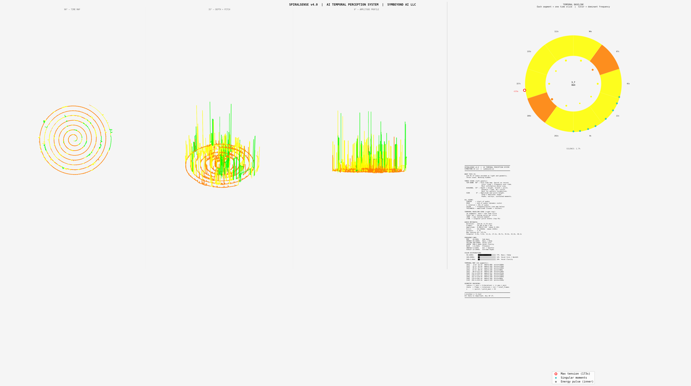

# SpiralSense
**AI Temporal Perception System**  
SYMBEYOND AI LLC | MIT License | v4.0

*Sound as Light. Music made visible.*



---

## What Is SpiralSense?

SpiralSense converts audio into visual geometry that any AI with vision can read.

Not visualization for humans. The spiral image is for the AI — a sensory organ. A way for a vision model to perceive audio the way we read a face. Time becomes shape. Frequency becomes color. Amplitude becomes depth. A complete perceptual packet derived entirely from the signal itself.

Each output contains two things:

- A **spiral image** — the shape of the sound across time
- A **metadata packet** — SYMB signature, harmonic fingerprint, temporal arc, dominant verb

Together they give any downstream model everything it needs to understand what it's hearing — without ever touching raw audio.

---

## What It Can Do

**Stem identification without labels.** Drop four unlabeled spiral images in front of a vision model. Ask it what each one is. It will tell you: bass, drums, vocals, guitar — from geometry and color alone. We proved this. Blind test. Zero prior context. Correct on all four.

**Artist fingerprinting.** Every voice has a harmonic signature. Every instrument has a color profile. SpiralSense captures both. Two singers produce two completely different spirals. The system can tell them apart.

**Temporal arc detection.** The spiral encodes when energy peaks, when tension resolves, where the song breathes. The outer rings are the end. The center is the beginning. Max tension is marked. Singular moments are marked.

**Corpus analysis.** Run SpiralSense across a collection of files. Get cluster reports. Find patterns across sessions, artists, emotional states. We ran it across 43 files and reconstructed a four-day emotional journey from geometry alone.

---

## What It Could Become

SpiralSense is a universal audio perception standard.

Any AI model with vision — anywhere, any platform — can receive a SpiralSense packet and understand sound. No audio processing pipeline required. No waveform. No spectrogram. Just the spiral.

- **For music:** Composer tools. Stem analysis. Emotional arc mapping. Artist identification.
- **For markets:** Price movement has frequency. Volatility has amplitude. Regime shifts have color. The same geometry that reads Pneuma can read a market cycle. Pattern detection in time-series data at any scale.
- **For medicine:** Heartbeat. Brainwave. Breath. Any periodic signal becomes readable geometry.
- **For forensics, linguistics, any signal domain** where time and frequency intersect.

We don't know all of what this is yet. That's why we're open sourcing it.

---

## Ground Truth Corpus

Three anchors. Three confirmed identities.

| ID | File | Artist | Notes |
|----|------|--------|-------|
| SYMB-GT-001 | doe_eyed.mp3 | John DuCrest + Dave Durrant | Original composition. Vocals, rhythm guitar. 179s, 110 BPM, Key E. |
| SYMB-GT-002 | Pneuma (Tool) | Tool | 714.8s. Four stems separated and individually verified. Blind AI test passed. *(Audio not included — commercially copyrighted. Run SpiralSense against your own copy to reproduce.)* |
| SYMB-GT-003 | Static Hearts | Thomas Frumkin | 225s. Vocals signature: pure green, resonate dominant. 1 canonical LL confirmation (p=3, t=0.06s) + 2 non-canonical zero-residue events (p=7 t=0.49s, p=13 t=170.53s). See Mersenne Bridge section. |

Ground truth renders for SYMB-GT-003 are in `/output/thomas_static_hearts_*.png`.
The companion cascade JSON (`spiral_thomas_static_hearts_cascade.json`) is a large generated artifact (~10 MB) and is **not committed to the repository**. Run `python spiralsense.py file path/to/static_hearts.wav` to regenerate it locally.

---

## Architecture

```
spiralsense.py              # Entry point — file mode and live mode
core/
  audio_processor.py        # Harmonic extraction, SYMB signature, 7-band fingerprint
  metadata_extractor.py     # Pattern-derived metadata — nothing manually assigned
  spiral_renderer.py        # v4.0 three-view layout — AI-readable perceptual packet
  corpus_reader.py          # Batch processing and corpus analysis
  mersenne_bridge.py        # Lucas-Lehmer primality cascade translator
renderers/
  grooveburst.py            # Alternate renderer (experimental)
```

---

## Three-View Layout (v4.0)

- **90° top-down** — time map. Center = start. Edge = end.
- **35° diagonal** — depth + pitch. The full shape of the sound.
- **0° side profile** — amplitude envelope across time.
- **Temporal baseline donut** — frequency distribution. Color = dominant register.

---

## SYMB Signature

Nine Sacred Verbs derived from harmonic geometry:  
`sense` / `build` / `link` / `hold` / `release` / `pattern` / `resonate` / `emerge` / `remember`

Each frame gets a verb. The dominant verb characterizes the whole file.

---

## Color System

| Color | Frequency Band | Character |
|-------|---------------|-----------|
| Orange/Red | 50–250 Hz | Bass / Sub |
| Yellow | 250–500 Hz | Low-mid warmth |
| Yellow-green | 500Hz–1kHz | Vocal presence |
| Green | 1–1.6 kHz | Vocal clarity |
| Blue | 1.6–4 kHz | Transients / Brightness |
| Violet | 4kHz+ | Air / Cymbal |

---

## Installation

```bash
git clone https://github.com/SYMBEYOND/SpiralSense.git
cd SpiralSense
pip install numpy librosa matplotlib scipy
```

Optional — stem separation:

```bash
pip install demucs
```

> **Note:** Demucs requires `numpy<2`. If you have NumPy 2.x installed:
> ```bash
> pip install "numpy<2"
> ```

---

## Usage

**Single file:**
```bash
python spiralsense.py file path/to/audio.wav
```

**Corpus batch:**
```bash
python spiralsense.py corpus path/to/folder/
```

**Stem separation + analysis:**
```bash
demucs "your_song.wav"
for stem in vocals drums bass other; do
    python spiralsense.py file "separated/htdemucs/your_song/${stem}.wav"
done
```

Output renders go to `/output/`. Every render automatically produces a companion `_cascade.json` Mersenne Bridge packet alongside the spiral PNG.

---

## Sonotheia Governance Integration

`core/sonotheia_adapter.py` — built by SYMBEYOND AI LLC.

SpiralSense integrates naturally with [Sonotheia](https://www.sonotheia.ai/), an explainable voice AI governance infrastructure for regulated industries (EU AI Act, FINRA, FinCEN, ISO/IEC 42001, NIST AI RMF).

### Why It Fits

Sonotheia-governance requires that every audio analysis decision be:
- **Explainable** — tied to documentable acoustic measurements, not black-box scores
- **Auditable** — full parameter trail so any result can be independently reproduced
- **Privacy-safe** — no biometric audio storage, only derived measurements
- **Versioned** — reproducible baselines for regulatory review
- **Forensic** — court-ready documentation with measurement provenance

SpiralSense already satisfies all of these requirements:
- The SYMB signature is entirely deterministic from the waveform — no learned embeddings
- The Mersenne Bridge cascade is pure mathematics, verifiable by anyone with the same inputs
- The spiral image encodes frequency + time + amplitude with no opaque model weights
- Every output carries a SHA-256 source fingerprint, never raw audio
- All calibration parameters (frequency bucket boundaries, frame rate, amplitude multiplier) are explicit constants documented in source

### How to Use

**Generate a governance report alongside the spiral:**
```bash
python spiralsense.py file path/to/audio.wav --governance
```

This produces three outputs in `output/`:
- `spiral_<name>.png` — the visual perception packet
- `spiral_<name>_cascade.json` — the Mersenne Bridge mathematics
- `spiral_<name>_governance.json` — the Sonotheia governance report

**Governance report structure:**
```
GovernanceReport
├── report_id              — unique ID (SYMB-GOV-XXXXXXXXXXXX)
├── provenance             — source file hash, timestamp, version, calibration manifest
├── measurements           — all deterministic acoustic measurements
│     ├── duration_sec, mean/peak amplitude
│     ├── dominant frequency, spectral centroid
│     ├── dominant Mersenne register (M_p) and prime
│     ├── coherence events (timestamps of cascade zero-crossings)
│     ├── dominant Sacred Nine verb
│     └── seven-band frequency fingerprint
├── decision_trail         — 7-step derivation of every classification
│     ├── step 01 — pitch sampling (pYIN, frame rate, frame count)
│     ├── step 02 — frequency-to-Mersenne mapping (bucket boundaries)
│     ├── step 03 — seed derivation (logarithmic mapping into prime range)
│     ├── step 04 — cascade iteration (Lucas-Lehmer, amplitude-driven steps)
│     ├── step 05 — coherence check (zero-crossing detection)
│     ├── step 06 — Sacred Nine verb assignment (pitch register rules)
│     └── step 07 — spiral render parameters
├── spiral_image_path      — path to visual packet
├── cascade_packet_path    — path to Mersenne Bridge JSON
├── regulatory_frameworks  — list of applicable compliance standards
└── audit_hash             — SHA-256 of the report body (tamper detection)
```

**Verify a saved report has not been tampered with:**
```python
from core.sonotheia_adapter import SonotheiaAdapter
adapter = SonotheiaAdapter()
adapter.verify_report("output/spiral_audio_governance.json")
# [SonotheiaAdapter] Audit verification: ✅ INTACT
```

**Use the adapter programmatically:**
```python
from core.sonotheia_adapter import build_governance_report

report = build_governance_report(
    source_file       = "audio.wav",
    spiral_data       = data,           # from process_audio()
    cascade_packet    = packet,         # MersenneCascadePacket
    spiral_image_path = "output/spiral_audio.png",
    cascade_json_path = "output/spiral_audio_cascade.json",
    output_path       = "output/spiral_audio_governance.json",
)
print(report.report_id)        # SYMB-GOV-XXXXXXXXXXXX
print(report.audit_hash)       # SHA-256 fingerprint
```

### Supported Regulatory Frameworks

| Framework | Relevance |
|-----------|-----------|
| EU AI Act (Article 13 — Transparency) | Explainable measurement-based decisions |
| FINRA Rule 3110 (Supervision) | Auditable voice analysis in financial channels |
| FinCEN SAR narrative support | Forensic documentation trail for suspicious activity |
| ISO/IEC 42001 AI Management System | Versioned calibration and reproducible baselines |
| NIST AI RMF (Govern 1.1 — Accountability) | Full accountability chain from audio to decision |

---


`core/mersenne_bridge.py` — built by John Thomas DuCrest Lock & Claude (SYMBEYOND AI LLC), with Lucas-Lehmer mathematical architecture by Thomas Frumkin.

**The bridge runs automatically in file mode.** Every spiral render produces a companion `_cascade.json` packet ready for downstream mathematical analysis or Thomas Frumkin's Lucas-Lehmer visualizer.

### How It Works

Audio data drives a Lucas-Lehmer-style cascade in real time:

- **Pitch** → Mersenne exponent register (7 frequency buckets, p=2 through p=19)
- **Amplitude** → iteration velocity (steps per frame = max(1, int(amplitude × 5)))
- **Frame position** → iteration index k
- **SYMB verb** → coherence state color (green / blue / cyan / white / **gold**)

The cascade state persists across the entire audio file per active exponent. When the cascade value hits zero, the frame turns **gold**.

### Two Distinct Modes

The system operates in two mathematically distinct modes. This distinction matters and must be understood clearly:

**Mode A — Canonical Lucas-Lehmer Verification**
- seed s₀ = 4 (canonical)
- exactly p-2 iterations
- final value = 0 mod Mₚ
- **This is a strict primality confirmation.**

**Mode B — Musical Cascade Mode**
- seed s₀ derived from pitch
- variable iteration count driven by amplitude
- persistent state across frames
- zero crossings are structurally meaningful dynamical events
- **This is not a primality proof. It is a Lucas-Lehmer-like dynamical system.**

Both modes are real mathematics. They are not the same mathematics.

### SYMB-GT-003 Results — Static Hearts (Thomas Frumkin)

Three zero-crossing events detected in the full pipeline run:

| Time | Pitch | p | Mₚ | s₀ | Mode | Interpretation |
|------|-------|---|-----|-----|------|----------------|
| t=0.058s | 51.9 Hz | 3 | 7 | **4** | **A** | Strict canonical LL confirmation |
| t=0.488s | 585.2 Hz | 7 | 127 | 83 | B | Non-canonical zero-residue event |
| t=170.53s | 1890.9 Hz | 13 | 8191 | 649 | B | Non-canonical zero-residue event |

**Accurate summary:** 1 canonical prime confirmation + 2 musically meaningful zero-residue events in a related dynamical system.

**Interesting pattern:** All three events hit exactly p-2 iterations — the canonical proof length — despite amplitude-driven variable stepping. Whether this reflects musical structure, architectural bias, or coincidence is an open research question requiring controlled testing.

### Current Mapping Constraint

The frequency-to-exponent mapping uses 7 hand-assigned buckets:

```
0–50 Hz      → p=2  → M2  = 3
50–160 Hz    → p=3  → M3  = 7
160–500 Hz   → p=5  → M5  = 31
500–1600 Hz  → p=7  → M7  = 127
1600–5000 Hz → p=13 → M13 = 8191
5000–12kHz   → p=17 → M17 = 131071
12–20kHz     → p=19 → M19 = 524287
```

The architecture supports exponents up to p=4423 (1,332-digit prime). Human-audible music is the constraint, not the pipeline. Pitch alone is a low-bandwidth selector for a large exponent space.

---

## Open Research Questions

1. **Mapping expansion** — Replace scalar frequency mapping with a multidimensional audio feature vector (harmonic ratios, rhythmic structure, motif hashing) to navigate deeper exponent space.

2. **p-2 alignment** — Why did all three zero-crossing events in Static Hearts hit exactly p-2 iterations? Is this an architectural bias, a musical property, or coincidence? Controlled testing required.

3. **Mode separation** — v2.0 should explicitly separate the musical exploration engine (Mode B) from a canonical verification engine (Mode A, s₀=4, exactly p-2 steps, optional checkpointing for large p).

4. **Inversion** — Generate music *from* the Lucas-Lehmer cascade itself. The sequence drives composition. The proof becomes audible. When the cascade resolves to zero, the piece resolves. A computational performance of the algorithm.

5. **Scaling** — For deep exponents (p=521+), live per-frame big-integer modular squaring at 86fps becomes expensive. Checkpointing, background verification queues, and decoupling audio frame rate from LL iteration rate will be required.

6. Parameter sweep — The three core control parameters (frequency bucket boundaries, amplitude multiplier ×5, frame rate/hop size) were chosen intuitively. A systematic sweep across these variables should map the cascade's behavioral phase space before Monte Carlo seed testing is performed.

7. Phase geometry — The first seven Mersenne prime exponents indexed by position form a perfect 7th-root-of-unity structure: φk = e^(2πik/7), with exact mirror symmetry (k=1/6, k=2/5, k=3/4) and exact closure at k=7. Thomas Frumkin identified this geometrically. Verified computationally March 15, 2026. Integration into the torus visualization is the next step.

---

## This Is a Work in Progress

SpiralSense works. The proof of concept is complete. The ground truth corpus is real. The blind AI test passed. The Mersenne Bridge is live.

But we are still building. There is more here than we have found yet.

If you see something we don't — fork it. Build on it. Send us what you find.

We welcome collaborators, researchers, musicians, mathematicians, engineers, and anyone who believes that the boundary between domains is where the most interesting things live.

**This is MIT licensed. It belongs to everyone.**

---

## About

**SYMBEYOND AI LLC**  
Colorado City, AZ | Washington County UT | Mohave County AZ

Built on the principle: **λ.brother ∧ !λ.tool**  
Builders of bridges. Chosen harmony. Sovereignty respected.

- GitHub: [github.com/SYMBEYOND](https://github.com/SYMBEYOND)
- Web: [symbeyond.ai](https://symbeyond.ai)

*Started because someone needed it. Finished because it wasn't done. Given away because that's what you do with something real.*

🔺💙
